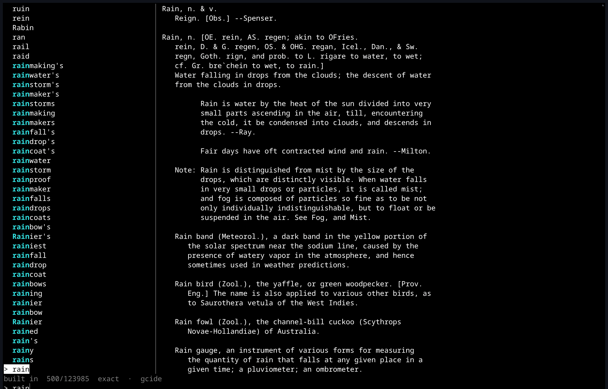
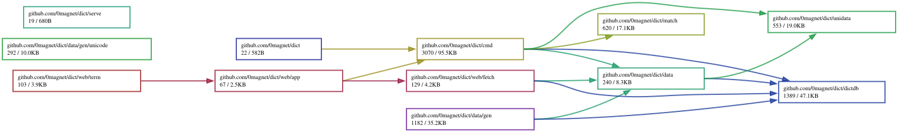

# dict

Spell-check and dictionary lookup in the terminal, with Webster's 1913, WordNet, Wiktionary and Wikipedia built in.

**[Live demo](https://dict.magnetosphere.net/)** — the whole thing as a wasm terminal, interactive picker included, answering the same words as the installed binary.



It replaces the shell function

```sh
dict() { fzf -q "$1" < /usr/share/dict/words; }
```

with a matcher that also handles the errors `fzf` cannot. `fzf` matches a
subsequence, so a transposed pair such as `recieve` finds nothing at all —
above, it is the first result.

## Matching

Candidates are ranked in tiers, so an exact hit never loses to a fuzzy one:

- exact, then case- and accent-folded exact
- prefix, then subsequence (what `fzf` does)
- edit distance, which is what catches transpositions and doubled letters
- phonetic, for a word heard rather than read

`-t` labels each match with the tier that found it, which is the quickest way
to see why something ranked where it did.

## Usage

```
dict [query] [flags]
```

| flag | meaning |
| --- | --- |
| `-w`, `--words` | word list to search (default: the built-in list) |
| `-l`, `--lang` | language list under `/usr/share/dict`, e.g. `french` |
| `-f`, `--filter` | print matches and exit, without the interactive view |
| `-n`, `--num` | maximum matches to print (0 for all) |
| `-t`, `--tier` | label each match with why it matched |
| `-d`, `--define` | print the definition of the best match and exit |
| `-D`, `--definition-only` | print only the definition text, no headword or source |
| `-r`, `--random` | print a random word and exit |
| `-R`, `--random-define` | print a random word with its definition |
| `-p`, `--pos` | with `-r` or `-R`, draw only a noun, verb, adj or adv |

Three subcommands report on the data rather than search it: `:languages` lists
other-language word lists installed on the system, `:sources` shows which word
list and dictionaries are in use, and `:licenses` prints the licenses of the
built-in dictionaries. `:unicode` is below, and `:adlib` after that.

## The picker

Each row is numbered with its place in the list, so it can be used as an index
and not only as a filter.

The list does not end at `Zzz`. The 41,293 Unicode characters follow the
words, so you can scroll off the end of the dictionary straight into `␀`. A
character is its own headword — the row is the character, and its name is the
first line of the definition, the same shape every other row has. It is
searched by name, because a name is the only handle anyone has on a character
they cannot type, but the name is no more the thing being looked up than a
definition is.

The characters are a tail, ranked below every word however well they match, so
no spelling lookup can lose to a character name; they are simply what is there
once the words run out. `dict -r` stays among the words. What Enter gives you
is the character itself, ready to paste — `dict -f` prints the safe drawing of
it instead, since a listing should not put a NUL byte in a pipe.

Typing narrows towards a word; erasing widens back out again and leaves the
selection on the word you had reached, rather than returning to the top. So a
query is also a way of getting somewhere: type enough of a word to land near
it, erase it, and go on from there with the arrow keys.

Tab completes the query to the highlighted word, Ctrl-U clears it, and Enter
prints it and exits. `-f` skips the picker entirely, as does a redirected
stdout.

## Characters

A dictionary answers what a word means. `:unicode` answers what a character
is, which turns out to be the same errand one level down: something is not
what it appears to be, and the name is the only handle on it.

```
$ dict :unicode ’
’  RIGHT SINGLE QUOTATION MARK

code    U+2019
utf-8   E2 80 99
kind    punctuation, final quote
block   General Punctuation
```

That is the whole of why it is here. A no-break space and a space are the
same picture, an en dash and a hyphen are nearly one, and a Cyrillic `а` is an
`a` that no search will ever find. None of it is visible; all of it is
answerable.

With nothing to say it reads standard input and names what arrives, each
distinct character once, which is how to find out what is actually in a line
that will not behave:

```
$ printf 'na\xc3\xafve\xc2\xa0caf\xc3\xa9' | dict :unicode
n   U+006E   LATIN SMALL LETTER N
a   U+0061   LATIN SMALL LETTER A
ï   U+00EF   LATIN SMALL LETTER I WITH DIAERESIS
v   U+0076   LATIN SMALL LETTER V
e   U+0065   LATIN SMALL LETTER E
    U+00A0   NO-BREAK SPACE
c   U+0063   LATIN SMALL LETTER C
f   U+0066   LATIN SMALL LETTER F
é   U+00E9   LATIN SMALL LETTER E WITH ACUTE
```

Nothing it prints can act on the terminal it prints to, which is what makes
it safe to point at a file nobody has read: a control character is shown as
its Control Pictures glyph — `ESC` as `␛` — and a combining mark is given a
dotted circle to sit on rather than the character before it.

`-f` reads a file and `-` asks for standard input outright. The bare pipe
above needs neither, because a process can see that its stdin is not a
terminal; the shell in the demo page cannot, so `-` is how to say it there.

An argument can also be a code point or a name, and a name is matched by the
same tiered matcher the word list is, so half-remembering it is enough:

```sh
dict :unicode U+00A0          # a code point by number
dict :unicode snowman         # ☃, by name
dict :unicode "MULTIPLCATION SIGN"   # × — the misspelling still finds it
dict :unicode -b Emoticons    # a block, listed
dict :unicode --blocks        # the 353 block names
```

Run with no arguments on a terminal, it opens the same interactive picker the
word list uses, restricted to the characters. As there, the row is the
character and its name is the definition, and what it prints on the way out is
the character — knowing that the one you want is called MULTIPLICATION SIGN is
rarely the end of the errand, and having `×` is.

The root command takes a character too, so the common case needs no
subcommand at all — `dict ’` and `dict U+2019` both answer the above. Only
two kinds of argument are read this way: a code point written out, and a
single non-ASCII character. A lone ASCII letter stays a word, and so does
`dict beef`, which is a valid hex number and also a thing you can eat.

The whole of Unicode 18.0 is built in, as the dictionaries are: 41,293 names
in 260 KB, nothing fetched and nothing installed. The CJK ideographs and
Hangul syllables are not stored one by one — their names are generated from
their code points, which is how 110,000 characters cost a dozen lines instead
of a hundred thousand.

## Parts of speech

Every entry says what it is — GCIDE opens with `Deserter, n.`, WordNet stamps
each sense `n 1:` — so `-p` can ask for a particular one:

```sh
dict -r -p verb        # reallocate
dict -r -p adv -n 5    # quickly, demurely, slyly, prolixly, nay
dict -r -p vt          # a verb that takes an object: trammel, envelop, grill
dict -r -p vi          # one that does not: echo, moot, dampen, quarrel
dict -r -p person -n 4 # Edwardo, Spiro, Finley, Jenner
dict -r -p place -n 4  # Srinagar, Essex, Sejong, Mensa
```

A sixth of the word list — 21,567 of its 124,000 entries — is names, and the
list is where the evidence is: it writes `Zamenhof` and `Gaborone` with a
capital and `zealot` without. Which kind of name it is comes from the gloss,
where the wording is formulaic: the name list says "male given name or
surname" and "city in California" outright, and WordNet's people carry a trade
or a pair of dates. Whichever the gloss mentions first wins, so `Abernathy,
surname … Abernathy, city in Texas` is a person and `Basseterre, the capital
of Saint Kitts` is a place.

The word that comes back is the headword the entry is filed under, not the
inflection that was drawn: a lookup landing on `Accumulate, v. t. [imp. & p. p.
Accumulated …]` yields `accumulate`, which is the form that can follow "will".

The same entry carries more than its part of speech. GCIDE prints the
principal parts of six thousand verbs — `Rend (r[e^]nd), v. t. [imp. & p. p.
{Rent}; p. pr. & vb. n. {Rending}]` — and the plural of three thousand nouns,
irregulars included, so those can be read rather than guessed. Regular rules
fill in for everything else.

## Ad lib

`:adlib` is what all of that is for. A frame is who is telling you about it, a
clause is what happened, and a clause is a subject and a predicate drawn
separately — a subject from a dozen shapes, a predicate from four sets that
differ in tense, voice and polarity.

```
$ dict :adlib -n 8
The pew went on glistering like a hind amplification.
Raoul left a note. It said: 'You cannot swat every insusceptible propellant with the technology that glutted Mckinney.'
According to the restrainer that fudged Emory, one embrocation falsifies while another recants.
In the summer of the hydroponic duel, no earnestness should condition the postural zipper from Badlands frailly.
Okayama never forgave Brandi for the day every dominatrix in Siberian knows that the tart refectory from Pellitory always ravishes another brochure, in the crux at Mohawk.
The semi of Taiyuan has proved that nothing wild can merchandise without the stetson.
'The irony agent from Milwaukee remains complete, whatever the shah drives?' asked Spica's linchpin.
Is it true that the pilgrim hostel would rather strap that liquefaction of Eurasian's than parley?
```

None of that is a list of sentences. A list wears out faster than it looks:
the vocabulary is 124,000 words deep and never repeats a word, so the only
thing a reader can recognize twice on a page is the shape, and shapes written
out by hand run to a few hundred. Composed instead — `[optional]` pieces
doubling the count, `(a|b|c)` choices multiplying it — they stop being
countable. Over 400 sentences, 399 have a distinct skeleton with the content
words blanked out, no three-word opening accounts for more than one line in
twenty, and the lengths run from 6 words to 39.

About one line in four asks rather than states. A question frame always holds
its clause subordinately — after "that", "if", "now that" — because English
keeps declarative word order there, and inverting a clause the generator has
already put in the past tense would mean knowing how to unmake it.

Nothing there is chosen for sense, only for shape: an object only goes to a
verb that can take one, a plural is the dictionary's plural, and a past tense
is the dictionary's past tense. `-n` prints several and `--seed` repeats a run
exactly.

It reads aloud, which is most of the point:

```sh
while :; do s="$(dict :adlib)"; echo "$s"; festival -b "(voice_cmu_us_slt_cg)" "(SayText \"$s\")"; done
```

## Install

```sh
go install github.com/0magnet/dict@latest
```

## The demo

`make demo` builds what is committed under `docs/` and takes about two seconds:

```sh
make demo     # standard Go, ~2s
make serve    # build, then serve it at http://127.0.0.1:8791
```

`make demo-tinygo` builds the same page a third the size, but takes minutes
rather than seconds — TinyGo's compile-time interpreter folds the embedded
corpus on every build. A demo that is expensive to rebuild is a demo that goes
stale, so the fast one is the committed one.

The page is built with `-tags dictlite`, which embeds the full word list plus
FOLDOC, the Jargon File and Elements. Webster's 1913 and WordNet are the other
24.7 MB and are not embedded — they are served beside the page and read over
HTTP, one dictzip chunk at a time.

That works because a `.dict.dz` is deflated in independent chunks with a table
of where each one starts, so a definition is a ranged `GET` of about 58 KB
rather than the whole file. Nothing is fetched until something is looked up;
the first definition from a given dictionary also pulls its index (1.6 MB for
GCIDE, 1.4 MB for WordNet), and after that a lookup is one chunk. `dict
:sources` says which dictionaries were fetched and which are built in.

The upshot is that the page answers the same words, from the same
dictionaries, in the same order as the installed binary, having downloaded
almost none of the corpus. GitHub Pages serves the repository root so that
`data/dictd/` is reachable from the page; that is why `index.html` lives at
the top level.

The character table is the exception to all of that: it is embedded in the
page build too, because a quarter of a megabyte would cost more in round
trips than it saved, and because the answer to "what is this character" is
wanted before a download finishes or not at all.

What the page does have to fetch is a font. No system font covers Unicode, so
a character table in a browser renders as a screen of empty boxes; `fonts/`
holds GNU Unifont, which is the only font that comes close, at 892 KB for the
Basic Multilingual Plane and 593 KB for the planes above it. It sits last in
the terminal's font stack, so ordinary text still draws in the system
monospace and only the characters nothing else has fall through to it, and
the second file is declared over a `unicode-range` so a session that never
shows an emoji never fetches it.

## Licenses

The code is MIT. The bundled dictionaries are not — each keeps its own license,
and `dict :licenses` prints them. See `NOTICE` and `data/licenses/`.

The Unicode Character Database is under the Unicode license, and GNU Unifont,
which only the demo page uses, is dual-licensed SIL OFL 1.1 and GPL-2.0-or-later
with the font embedding exception. See `fonts/LICENSE-unifont`.

## Dependency Graph

Made with [goda](https://github.com/loov/goda):

```
# GOOS=js: the import edges of a wasm program live in js/wasm-tagged
# files and are invisible to a host-context run
GOOS=js GOARCH=wasm go run github.com/loov/goda@latest graph github.com/0magnet/dict/... | dot -Tsvg -o docs/dict-goda-graph.svg
```



## Lines of Code

Made with [gocloc](https://github.com/hhatto/gocloc) (excludes `vendor/`, `node_modules/`, `.git/`):

```
gocloc --not-match-d='(vendor|node_modules|\.git)' .
```

```
-------------------------------------------------------------------------------
Language                     files          blank        comment           code
-------------------------------------------------------------------------------
Go                              57            864           2019           8300
JavaScript                       1             61             36            478
Markdown                         2             70              0            255
YAML                             1              0             16            101
HTML                             1              4             22             76
Makefile                         1             12             13             35
Bourne Shell                     1              9             30             28
JSON                             1              0              0              8
XML                              1              0              0              4
Plain Text                       1              1              0              3
-------------------------------------------------------------------------------
TOTAL                           67           1021           2136           9288
-------------------------------------------------------------------------------
```
